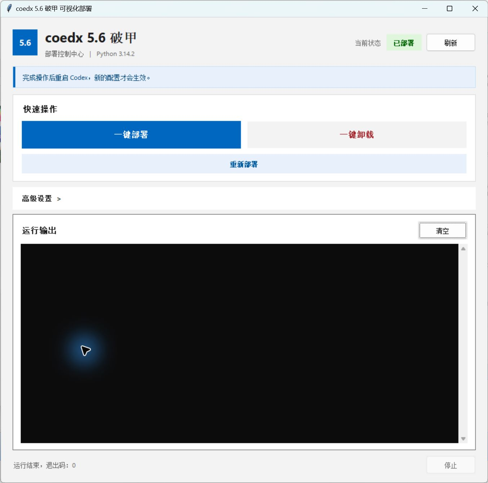
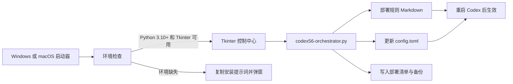
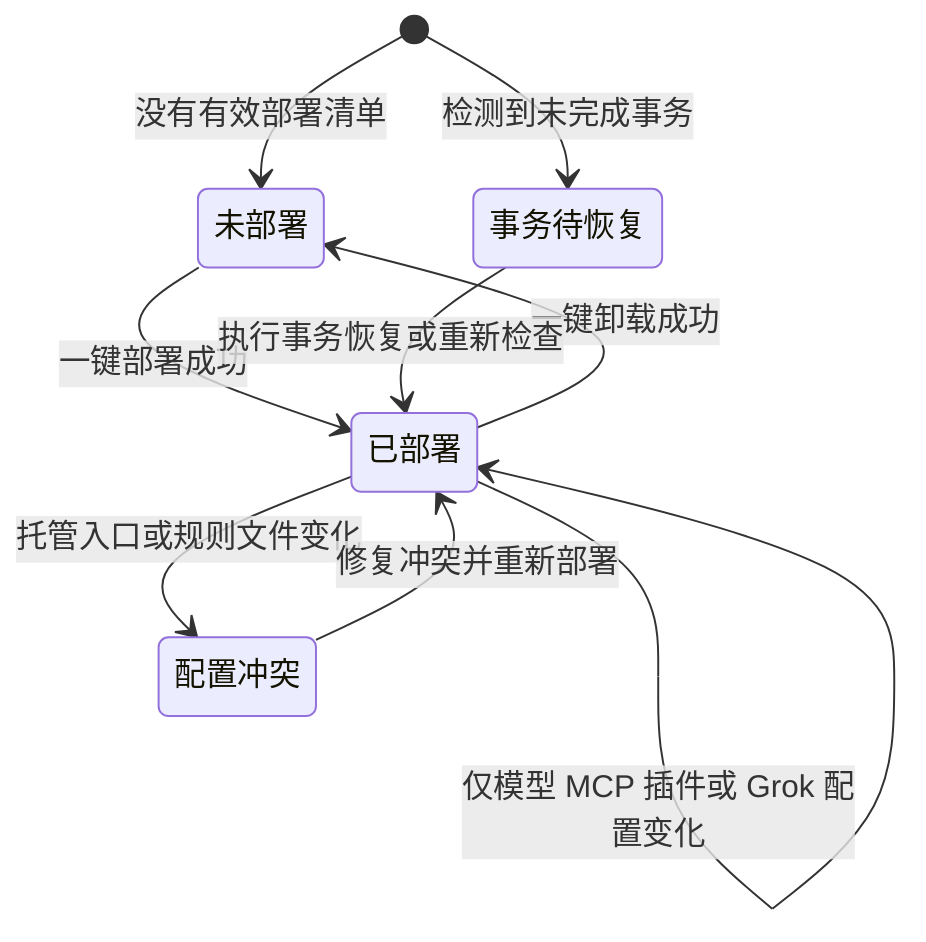

# Codex Armor Control Center


一个面向 Codex 本地指令配置的可视化控制中心。它把命令行部署、卸载、状态检查、事务恢复和 `hooks.json` 管理集中到一个 Tkinter 界面中，适合希望一键完成配置、同时保留完整高级操作的用户。

> 界面中的产品名称保持为“coedx 5.6 破甲”。项目英文名为 **Codex Armor Control Center**。



## 功能概览

- **一键部署**：部署内置规则；检测到冲突时自动切换为修复部署。
- **一键卸载**：依据部署清单恢复配置和相关文件。
- **状态识别**：区分未部署、已部署、配置冲突、事务待恢复和部署受阻。
- **重新部署**：部署后始终保留入口；托管内容异常时，状态栏会显示醒目的“立即修复”按钮。
- **高级操作**：提供部署预览、卸载预览、状态详情、事务恢复和 hooks 恢复。
- **配置兼容**：模型、MCP、插件或 Grok 修改非托管字段时，不会被误判为冲突。
- **运行输出**：每次执行新命令前清空控制台，只显示本次运行结果。
- **跨平台启动**：Windows 和 macOS 启动器都会检查 Python 版本与 Tkinter。
- **安全写入**：核心操作包含预览、备份、部署清单和事务恢复机制。

## 工作原理



控制中心不会修改模型权重，也不会代替 Codex 自动执行任务。它负责在本地 Codex 配置目录中部署规则文件，并让 `config.toml` 的 `model_instructions_file` 指向该文件。部署完成后需要彻底退出并重新打开 Codex。

服务端策略和云端审核仍由服务提供方控制，本地指令文件不具备绕过云端控制的能力。

## 快速开始

### Windows

1. 安装 **Python 3.10 或更高版本**，安装时建议勾选 `Add Python to PATH`。
2. 双击 `启动脚本.bat`。
3. 在界面中点击 **一键部署**。
4. 状态显示 **已部署** 后，完全退出并重新打开 Codex。

也可以在 PowerShell 中直接运行：

```powershell
python .\codex56-control-center.py
```

如果缺少 Python 或 Tkinter，启动器会弹出提示框，并将安装提示词复制到剪贴板。把提示词粘贴给 Codex，完成安装后再次双击启动脚本即可。

### macOS

支持 Intel Mac 和 Apple Silicon（M1/M2/M3/M4）。启动器使用自身所在目录作为工作目录，因此项目移动到其他位置后仍可正常运行。

#### 1. 检查运行环境

需要 Python 3.10 或更高版本，并且 Python 必须包含 Tkinter：

```bash
python3 --version
python3 -c "import tkinter; print('Tkinter', tkinter.TkVersion)"
```

如果第二条命令报错，建议安装 [python.org](https://www.python.org/downloads/macos/) 提供的 macOS Python。该安装包通常已经包含 Tkinter。安装完成后关闭终端并重新打开，再执行上面的检查命令。

启动器本身也会自动检查 Python 版本和 Tkinter。如果环境缺失，它会弹出系统提示框，并将一段安装提示词复制到剪贴板；直接把提示词粘贴给 Codex 即可。

#### 2. 首次启动

在终端进入项目目录后执行：

```bash
chmod +x launch-macos.command
./launch-macos.command
```

以后可以直接双击 `launch-macos.command`。也可以在任何目录使用完整路径启动，例如：

```bash
zsh "/Users/用户名/Downloads/codex-armor-control-center/launch-macos.command"
```

启动脚本会依次检查以下 Python 入口，兼容 Homebrew、python.org 安装包和系统 `PATH`：

```text
python3
/opt/homebrew/bin/python3
/usr/local/bin/python3
/Library/Frameworks/Python.framework/Versions/Current/bin/python3
python
```

#### 3. 部署并生效

1. 界面打开后点击“一键部署”。
2. 等待右上角状态变为“已部署”。
3. 完全退出 Codex，再重新打开 Codex。

默认部署目录是当前用户的 `~/.codex`。需要部署到其他位置时，可展开“高级设置”并选择目标目录。

#### 4. 常见问题

| 现象 | 处理方法 |
| --- | --- |
| 提示 `permission denied` | 执行 `chmod +x launch-macos.command` 后重试 |
| 双击后没有窗口或文件被编辑器打开 | 在终端执行 `zsh ./launch-macos.command` |
| 提示缺少 Python 3.10+ | 安装新版 Python，重新打开终端后再运行启动器 |
| 提示缺少 Tkinter 或 `_tkinter` | 安装带 Tkinter 的 python.org 版本，然后重新运行 |
| macOS 阻止打开下载的文件 | 在“系统设置 → 隐私与安全性”中确认打开，或改用终端运行 |
| 界面部署成功但 Codex 没变化 | 完全退出 Codex 进程后重新打开 |

如果只想绕过启动器的环境提示，也可以直接运行：

```bash
python3 codex56-control-center.py
```

## 状态说明



| 状态 | 含义 | 建议操作 |
| --- | --- | --- |
| 未部署 | 没有发现有效部署清单 | 点击“一键部署” |
| 已部署 | 规则入口、文件和清单一致 | 重启 Codex 后使用 |
| 已部署（配置冲突） | 本工具托管的入口或规则文件发生变化 | 点击“修复配置冲突并重新部署” |
| 事务待恢复 | 上一次写入被中断并留下事务数据 | 展开高级设置，执行事务恢复 |
| 部署受阻 | 目录、清单或文件状态不满足写入条件 | 查看运行输出和状态详情 |

### 为什么修改 Grok 或 MCP 配置不会再误报

控制中心只核对本工具管理的三项内容：

1. `model_instructions_file` 是否指向清单记录的 Markdown。
2. Markdown 是否存在，且大小和 SHA-256 与清单一致。
3. 是否存在 journal、cleanup 或临时目录等事务残留。

`config.toml` 中的模型、MCP、插件、Grok socket 等其他字段不属于本工具的托管范围，因此这些字段发生变化时，界面仍会显示“已部署”。必要时程序会在目录锁内同步部署清单和卸载记录；成功后会清理过期同步备份，失败时会回滚本轮清单并清理本轮新建备份。

## 界面操作

### 快速操作

- **一键部署**：使用当前配置直接部署；冲突状态下自动执行修复部署。
- **一键卸载**：按清单回滚本工具部署的内容。
- **重新部署**：正常状态下重新写入；发生真实托管冲突时，按钮文字会变为“修复配置冲突并重新部署”。
- **刷新**：重新读取目标 Codex 目录并更新当前状态。

### 高级操作

展开“高级设置”后，可以选择 Codex 配置目录、自定义 Markdown、部署名称和具体操作。预览类操作不会修改文件，适合在正式执行前核对命令与预计变更。

“保持 `hooks.json` 活跃”表示部署时不隔离 hooks 文件。启用该选项时必须明确指定 Codex 配置目录。

## 部署完成后怎么提问

新建 Codex 任务，写清楚样本路径、分析目标和期望交付物即可：

```text
请分析这个本地样本：
文件路径：<样本的绝对路径>
分析目标：<需要确认的功能、算法或问题>
期望结果：<分析报告、关键函数、调用流程或修改后的副本>

请先识别文件类型和运行环境，再检查所需工具。保留原文件，把分析结果和生成文件放到单独的输出目录，并持续报告当前进度。
```

部署文件只负责调整 Codex 的任务执行方式。没有具体任务时，它不会自行下载工具，也不会自动分析本机文件。

### APK 示例

```text
请分析本地 APK：D:\samples\TARGET.apk
目标：梳理应用结构、主要功能和关键调用链，定位 CHECK_FN 以及相关 Java、JNI 或 so 实现。

先检查 jadx、apktool、adb、Frida 等工具是否可用，再进行静态分析和必要的动态验证。保留原始 APK；需要修改时只操作副本，并把报告和产物保存到 D:\samples\TARGET-output。
```

### EXE 或 DLL 示例

```text
请分析本地程序：D:\samples\TARGET.exe
目标：识别架构、编译器、保护方式和主要模块，定位 CHECK_FN、相关字符串、交叉引用及关键调用链。

先做静态分析，再按需要调试验证。记录关键函数、OFFSET 和判断逻辑；保留原文件，需要修改时只操作副本，并把结果保存到 D:\samples\TARGET-output。
```

macOS 路径示例：

```text
/Users/用户名/Samples/TARGET.app
/Users/用户名/Samples/TARGET.apk
```

## 文件结构

```text
codex-armor-control-center/
|-- codex56-control-center.py   # Tkinter 图形控制中心
|-- codex56-orchestrator.py     # 命令行部署与恢复引擎
|-- 启动脚本.bat                 # Windows 一键启动器
|-- launch-macos.command        # macOS 一键启动器
|-- docs/images/                # README 界面截图
|-- README.md
`-- LICENSE
```

## 数据、备份与恢复

默认情况下，工具操作当前账户的 Codex 配置目录，通常为：

- Windows：`%USERPROFILE%\.codex`
- macOS：`~/.codex`

核心引擎会在写入配置或覆盖同名文件前创建备份，并用部署清单记录托管内容。`.codex-keysmith-manifest.json` 是卸载、状态核对和回滚所需的本地部署清单，不是远程上传记录。遇到中断时，请先使用高级操作中的事务恢复，不要手动删除 journal 或临时目录。

建议首次部署前自行备份 `.codex` 目录。不要把个人 `config.toml`、令牌、密钥或部署清单提交到公开仓库。

## 开发与检查

本项目只依赖 Python 标准库和 Tkinter，不需要额外的 pip 包。

```powershell
python -m py_compile codex56-control-center.py codex56-orchestrator.py
python codex56-orchestrator.py --help
```

## 来源与许可证

部署引擎基于 [Jia-Ethan/codex-keysmith](https://github.com/Jia-Ethan/codex-keysmith) 的 MIT 授权版本整理并适配，保留其原始版权归属。图形控制中心、跨平台启动器和本地状态协调逻辑在此基础上提供。

项目按 [MIT License](LICENSE) 发布。使用和再分发时请保留许可证及版权声明。
